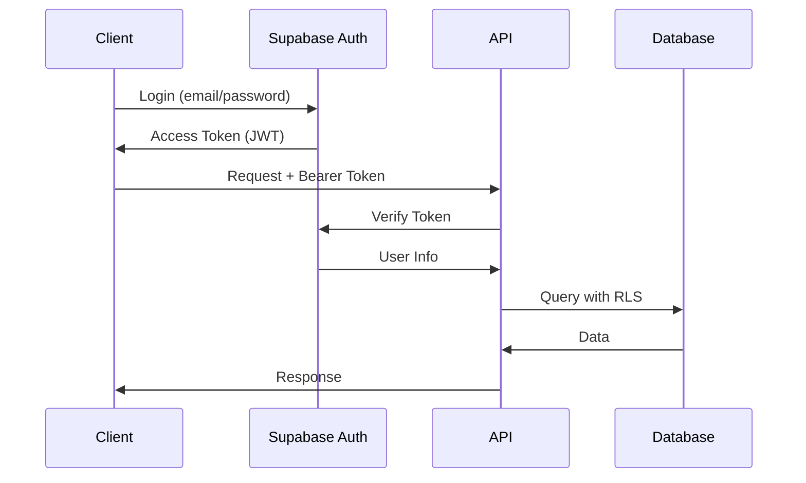

# API Documentation

## Overview

Order Friends API is a multi-tenant order management system built with NestJS, Supabase, and PostgreSQL. This API provides comprehensive functionality for brand and branch management, product catalog, inventory tracking, and order processing.

## Table of Contents

1. [Getting Started](#getting-started)
2. [Authentication](#authentication)
3. [API Endpoints](#api-endpoints)
4. [Data Models](#data-models)
5. [Error Handling](#error-handling)
6. [Rate Limiting](#rate-limiting)
7. [Examples](#examples)
8. [Testing](#testing)

## Getting Started

### Base URL

```
Development: http://localhost:4000
Staging:     https://staging-api.orderfriends.app
Production:  https://api.orderfriends.app
```

### Interactive API Documentation

Swagger UI is available at:
```
{BASE_URL}/api-docs
```

### Quick Start

1. **Get a Supabase Account**
   - Sign up at https://supabase.com
   - Create a new project
   - Note your project URL and keys

2. **Authenticate**
   ```bash
   # Sign up or login via Supabase client
   # Get access token from Supabase Auth
   ```

3. **Make Your First Request**
   ```bash
   curl -X GET \
     https://api.orderfriends.app/health \
     -H 'Content-Type: application/json'
   ```

## Authentication

### Authentication Methods

The API uses **Supabase Authentication** with JWT tokens.

#### 1. Authentication Flow



#### 2. Getting an Access Token

**Via Supabase Client SDK:**

```javascript
import { createClient } from '@supabase/supabase-js';

const supabase = createClient(SUPABASE_URL, SUPABASE_ANON_KEY);

// Sign up
const { data, error } = await supabase.auth.signUp({
  email: 'user@example.com',
  password: 'secure_password',
});

// Sign in
const { data: { session } } = await supabase.auth.signInWithPassword({
  email: 'user@example.com',
  password: 'secure_password',
});

const accessToken = session.access_token;
```

#### 3. Using the Access Token

Include the token in the `Authorization` header:

```bash
curl -X GET \
  https://api.orderfriends.app/me \
  -H 'Authorization: Bearer YOUR_ACCESS_TOKEN' \
  -H 'Content-Type: application/json'
```

### Authorization & Permissions

The API uses **Role-Based Access Control (RBAC)** with three main roles:

| Role | Permissions | Description |
|------|-------------|-------------|
| `brand_owner` | Full access to brand resources | Can manage brands, branches, and all data |
| `branch_manager` | Branch-level access | Can manage single branch operations |
| `staff` | Limited access | Can view and process orders only |

### Public Endpoints

Some endpoints are publicly accessible without authentication:

- `GET /health` - Health check
- `GET /public/branch/:id` - Public branch info
- `GET /public/branch/:id/products` - Public product catalog
- `POST /public/orders` - Create order (public)
- `GET /public/orders/:id` - View order status (public)

## API Endpoints

### Health Check

#### `GET /health`

Check API health status and database connectivity.

**Response:**
```json
{
  "status": "ok",
  "info": {
    "supabase": {
      "status": "up"
    }
  },
  "error": {},
  "details": {
    "supabase": {
      "status": "up"
    }
  }
}
```

### Authentication Endpoints

#### `GET /me`

Get current user information.

**Headers:**
```
Authorization: Bearer {token}
```

**Response:**
```json
{
  "id": "uuid",
  "email": "user@example.com",
  "role": "brand_owner",
  "created_at": "2026-01-01T00:00:00.000Z"
}
```

### Brand Management

#### `POST /brands`

Create a new brand.

**Headers:**
```
Authorization: Bearer {token}
```

**Request Body:**
```json
{
  "name": "My Coffee Shop",
  "description": "Premium coffee experience"
}
```

**Response:**
```json
{
  "id": "brand-uuid",
  "name": "My Coffee Shop",
  "description": "Premium coffee experience",
  "owner_id": "user-uuid",
  "created_at": "2026-01-01T00:00:00.000Z"
}
```

#### `GET /brands`

List all brands owned by the current user.

**Response:**
```json
[
  {
    "id": "brand-uuid",
    "name": "My Coffee Shop",
    "description": "Premium coffee experience",
    "owner_id": "user-uuid",
    "created_at": "2026-01-01T00:00:00.000Z"
  }
]
```

#### `GET /brands/:id`

Get brand details.

#### `PATCH /brands/:id`

Update brand information.

#### `DELETE /brands/:id`

Delete a brand (cascade deletes all branches and related data).

### Branch Management

#### `POST /branches`

Create a new branch.

**Request Body:**
```json
{
  "brand_id": "brand-uuid",
  "name": "Downtown Location",
  "address": "123 Main St, City",
  "phone": "010-1234-5678"
}
```

**Response:**
```json
{
  "id": "branch-uuid",
  "brand_id": "brand-uuid",
  "name": "Downtown Location",
  "address": "123 Main St, City",
  "phone": "010-1234-5678",
  "is_active": true,
  "created_at": "2026-01-01T00:00:00.000Z"
}
```

#### `GET /branches`

List all branches for the current user's brands.

**Query Parameters:**
- `brandId` (optional) - Filter by brand ID

**Response:**
```json
[
  {
    "id": "branch-uuid",
    "brand_id": "brand-uuid",
    "name": "Downtown Location",
    "address": "123 Main St, City",
    "phone": "010-1234-5678",
    "is_active": true
  }
]
```

### Product Management

#### `POST /products`

Create a new product.

**Request Body:**
```json
{
  "branch_id": "branch-uuid",
  "category_id": "category-uuid",
  "name": "Americano",
  "description": "Premium coffee",
  "price": 4500,
  "cost": 1500,
  "is_hidden": false,
  "sort_order": 1
}
```

**Response:**
```json
{
  "id": "product-uuid",
  "branch_id": "branch-uuid",
  "category_id": "category-uuid",
  "name": "Americano",
  "description": "Premium coffee",
  "price": 4500,
  "cost": 1500,
  "is_hidden": false,
  "sort_order": 1,
  "created_at": "2026-01-01T00:00:00.000Z"
}
```

#### `GET /products`

List products with pagination.

**Query Parameters:**
- `branchId` (required) - Branch ID
- `categoryId` (optional) - Filter by category
- `page` (optional, default: 1) - Page number
- `limit` (optional, default: 20) - Items per page
- `search` (optional) - Search by product name

**Response:**
```json
{
  "data": [
    {
      "id": "product-uuid",
      "name": "Americano",
      "price": 4500,
      "category": {
        "id": "category-uuid",
        "name": "Coffee"
      }
    }
  ],
  "pagination": {
    "page": 1,
    "limit": 20,
    "total": 100,
    "totalPages": 5
  }
}
```

#### `GET /products/:id`

Get product details.

#### `PATCH /products/:id`

Update product information.

#### `DELETE /products/:id`

Delete a product.

### Order Management

#### `POST /orders`

Create a new order.

**Request Body:**
```json
{
  "branch_id": "branch-uuid",
  "customer_name": "John Doe",
  "customer_phone": "010-1234-5678",
  "items": [
    {
      "product_id": "product-uuid",
      "quantity": 2,
      "unit_price": 4500
    }
  ],
  "total_amount": 9000,
  "payment_method": "card",
  "notes": "No sugar please"
}
```

**Response:**
```json
{
  "id": "order-uuid",
  "order_no": "ORD-20260106-0001",
  "branch_id": "branch-uuid",
  "customer_name": "John Doe",
  "customer_phone": "010-1234-5678",
  "status": "pending",
  "total_amount": 9000,
  "payment_method": "card",
  "items": [
    {
      "product_id": "product-uuid",
      "product_name": "Americano",
      "quantity": 2,
      "unit_price": 4500,
      "subtotal": 9000
    }
  ],
  "created_at": "2026-01-01T00:00:00.000Z"
}
```

#### `GET /orders`

List orders with pagination and filtering.

**Query Parameters:**
- `branchId` (required) - Branch ID
- `status` (optional) - Filter by status: `pending`, `confirmed`, `preparing`, `ready`, `completed`, `cancelled`
- `page` (optional, default: 1)
- `limit` (optional, default: 20)
- `startDate` (optional) - Filter from date (YYYY-MM-DD)
- `endDate` (optional) - Filter to date (YYYY-MM-DD)

**Response:**
```json
{
  "data": [
    {
      "id": "order-uuid",
      "order_no": "ORD-20260106-0001",
      "customer_name": "John Doe",
      "status": "pending",
      "total_amount": 9000,
      "created_at": "2026-01-01T00:00:00.000Z"
    }
  ],
  "pagination": {
    "page": 1,
    "limit": 20,
    "total": 50,
    "totalPages": 3
  }
}
```

#### `GET /orders/:id`

Get order details with items.

#### `PATCH /orders/:id/status`

Update order status.

**Request Body:**
```json
{
  "status": "confirmed"
}
```

### Dashboard & Analytics

#### `GET /dashboard`

Get dashboard statistics.

**Query Parameters:**
- `branchId` (required) - Branch ID
- `period` (optional) - `today`, `week`, `month`, `year`

**Response:**
```json
{
  "sales": {
    "today": 150000,
    "week": 1200000,
    "month": 4800000,
    "growth": 15.5
  },
  "orders": {
    "today": 45,
    "week": 350,
    "month": 1400,
    "pending": 5,
    "preparing": 3
  },
  "products": {
    "total": 50,
    "active": 48,
    "outOfStock": 2
  },
  "topProducts": [
    {
      "id": "product-uuid",
      "name": "Americano",
      "sales": 250,
      "revenue": 1125000
    }
  ]
}
```

### Public API Endpoints

#### `GET /public/branch/:branchId`

Get public branch information (no auth required).

**Response:**
```json
{
  "id": "branch-uuid",
  "name": "Downtown Location",
  "address": "123 Main St",
  "phone": "010-1234-5678",
  "is_active": true
}
```

#### `GET /public/branch/:branchId/products`

Get public product catalog (no auth required).

**Rate Limit:** 30 requests per minute per IP

#### `POST /public/orders`

Create public order (no auth required).

**Rate Limit:** 5 requests per minute per IP, 5-minute block after limit

## Data Models

### Brand

```typescript
interface Brand {
  id: string;
  name: string;
  description?: string;
  owner_id: string;
  created_at: string;
  updated_at: string;
}
```

### Branch

```typescript
interface Branch {
  id: string;
  brand_id: string;
  name: string;
  address?: string;
  phone?: string;
  is_active: boolean;
  created_at: string;
  updated_at: string;
}
```

### Product

```typescript
interface Product {
  id: string;
  branch_id: string;
  category_id?: string;
  name: string;
  description?: string;
  price: number;
  cost?: number;
  image_url?: string;
  is_hidden: boolean;
  sort_order: number;
  created_at: string;
  updated_at: string;
}
```

### Order

```typescript
interface Order {
  id: string;
  order_no: string;
  branch_id: string;
  customer_name?: string;
  customer_phone?: string;
  status: OrderStatus;
  total_amount: number;
  payment_method?: string;
  notes?: string;
  created_at: string;
  updated_at: string;
}

type OrderStatus =
  | 'pending'
  | 'confirmed'
  | 'preparing'
  | 'ready'
  | 'completed'
  | 'cancelled';
```

### OrderItem

```typescript
interface OrderItem {
  id: string;
  order_id: string;
  product_id: string;
  product_name: string;
  quantity: number;
  unit_price: number;
  subtotal: number;
  created_at: string;
}
```

## Error Handling

### Error Response Format

```json
{
  "statusCode": 400,
  "message": "Validation failed",
  "error": "Bad Request",
  "details": [
    {
      "field": "price",
      "message": "price must be a positive number"
    }
  ]
}
```

### HTTP Status Codes

| Code | Description |
|------|-------------|
| 200 | Success |
| 201 | Created |
| 400 | Bad Request - Invalid input |
| 401 | Unauthorized - Authentication required |
| 403 | Forbidden - Insufficient permissions |
| 404 | Not Found |
| 409 | Conflict - Resource already exists |
| 429 | Too Many Requests - Rate limit exceeded |
| 500 | Internal Server Error |

### Common Errors

#### 1. Authentication Error

```json
{
  "statusCode": 401,
  "message": "Unauthorized",
  "error": "Unauthorized"
}
```

**Solution:** Include valid `Authorization: Bearer {token}` header

#### 2. Permission Error

```json
{
  "statusCode": 403,
  "message": "Insufficient permissions",
  "error": "Forbidden"
}
```

**Solution:** Ensure your account has the required role/permissions

#### 3. Validation Error

```json
{
  "statusCode": 400,
  "message": "Validation failed",
  "error": "Bad Request",
  "details": [
    {
      "field": "email",
      "message": "email must be a valid email address"
    }
  ]
}
```

**Solution:** Fix the invalid fields in your request

#### 4. Rate Limit Error

```json
{
  "statusCode": 429,
  "message": "Too many requests",
  "error": "Rate Limit Exceeded"
}
```

**Solution:** Wait before making more requests. Check `X-RateLimit-Reset` header.

## Rate Limiting

### Rate Limit Headers

All responses include rate limit information:

```
X-RateLimit-Limit: 60        # Maximum requests allowed
X-RateLimit-Remaining: 45    # Requests remaining
X-RateLimit-Reset: 1609459200 # Unix timestamp when limit resets
```

### Rate Limit Rules

| Endpoint | Limit | Duration | Block |
|----------|-------|----------|-------|
| Public branch info | 60 req/min | 1 minute | - |
| Public products | 30 req/min | 1 minute | - |
| Public orders (create) | 5 req/min | 1 minute | 5 minutes |
| Public orders (view) | 30 req/min | 1 minute | - |
| File upload (single) | 20 req/min | 1 minute | - |
| File upload (batch) | 10 req/min | 1 minute | - |

### Rate Limiting Strategy

- **User-based** for authenticated requests (by user ID)
- **IP-based** for public/anonymous requests
- **Progressive blocking** for abuse prevention

## Examples

### Complete Order Flow Example

```javascript
// 1. Get branch information
const branch = await fetch('https://api.orderfriends.app/public/branch/branch-123')
  .then(r => r.json());

// 2. Get available products
const products = await fetch('https://api.orderfriends.app/public/branch/branch-123/products')
  .then(r => r.json());

// 3. Create an order
const order = await fetch('https://api.orderfriends.app/public/orders', {
  method: 'POST',
  headers: { 'Content-Type': 'application/json' },
  body: JSON.stringify({
    branch_id: 'branch-123',
    customer_name: 'John Doe',
    customer_phone: '010-1234-5678',
    items: [
      {
        product_id: products[0].id,
        quantity: 2,
        unit_price: products[0].price,
      },
    ],
    total_amount: products[0].price * 2,
    payment_method: 'card',
  }),
}).then(r => r.json());

// 4. Check order status
const orderStatus = await fetch(`https://api.orderfriends.app/public/orders/${order.id}`)
  .then(r => r.json());

console.log('Order created:', order.order_no);
console.log('Current status:', orderStatus.status);
```

### Authenticated Product Management

```javascript
const ACCESS_TOKEN = 'your-supabase-access-token';

// Create a product
const product = await fetch('https://api.orderfriends.app/products', {
  method: 'POST',
  headers: {
    'Content-Type': 'application/json',
    'Authorization': `Bearer ${ACCESS_TOKEN}`,
  },
  body: JSON.stringify({
    branch_id: 'branch-123',
    name: 'Cappuccino',
    price: 5000,
    cost: 2000,
    is_hidden: false,
    sort_order: 2,
  }),
}).then(r => r.json());

// Update product
const updated = await fetch(`https://api.orderfriends.app/products/${product.id}`, {
  method: 'PATCH',
  headers: {
    'Content-Type': 'application/json',
    'Authorization': `Bearer ${ACCESS_TOKEN}`,
  },
  body: JSON.stringify({
    price: 5500,
  }),
}).then(r => r.json());

// List products with pagination
const productList = await fetch(
  'https://api.orderfriends.app/products?branchId=branch-123&page=1&limit=20',
  {
    headers: {
      'Authorization': `Bearer ${ACCESS_TOKEN}`,
    },
  }
).then(r => r.json());
```

## Testing

### Testing with cURL

```bash
# Health check
curl -X GET https://api.orderfriends.app/health

# Get public products
curl -X GET 'https://api.orderfriends.app/public/branch/branch-123/products'

# Create order
curl -X POST https://api.orderfriends.app/public/orders \
  -H 'Content-Type: application/json' \
  -d '{
    "branch_id": "branch-123",
    "customer_name": "John Doe",
    "customer_phone": "010-1234-5678",
    "items": [
      {
        "product_id": "product-456",
        "quantity": 2,
        "unit_price": 4500
      }
    ],
    "total_amount": 9000,
    "payment_method": "card"
  }'

# Get authenticated data
curl -X GET https://api.orderfriends.app/me \
  -H 'Authorization: Bearer YOUR_ACCESS_TOKEN'
```

### Testing with Postman

1. Download the Postman collection: [postman-collection.json](#)
2. Import into Postman
3. Set environment variables:
   - `BASE_URL`: API base URL
   - `ACCESS_TOKEN`: Your Supabase access token
4. Run requests

## Support

- **Documentation:** https://docs.orderfriends.app
- **GitHub Issues:** https://github.com/someday486/order_friends/issues
- **API Status:** https://status.orderfriends.app

---

**API Version:** 1.0.0
**Last Updated:** 2026-02-06
**Maintained by:** Order Friends Team
